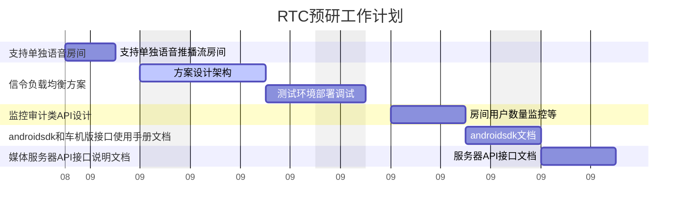

# RTC后续计划

演示后领导反馈提出的：
1.sdk使用手册
2.android接入指南
3.RTC集群
4.语音群聊

对现有工作进行总结整理，会按进行顺序待完成的：

- 通过负载均衡器选择多个可用信令服务器的修改
  根据房间号进行负载均衡支持高可用的方案
  srs集群部署方法，信令服务器负载均衡配置和部署方法

- Demo项目语音房间的修改
  修改代码支持单独推送和播放音频码流

- 监控审计类API设计
  房间数量
  用户数量
  服务监控等

- 搭建服务端的运维部署手册
  根据最新的调研成果提供服务端的运维部署说明
  包括新增的srs配置文件
  srs-rtc-server的初始化脚本
  容器化启动时的端口配置和正常情况时api验证的操作方法

- android sdk和车机版接口使用手册文档
  android端webrtc源码编译方法说明
  sdk中api接口使用方法和示例
  webrtc extension中用于支持vp9需要用到的方法使用说明和示例

- 媒体服务器API接口说明文档
- 信令服务器API接口说明文档

